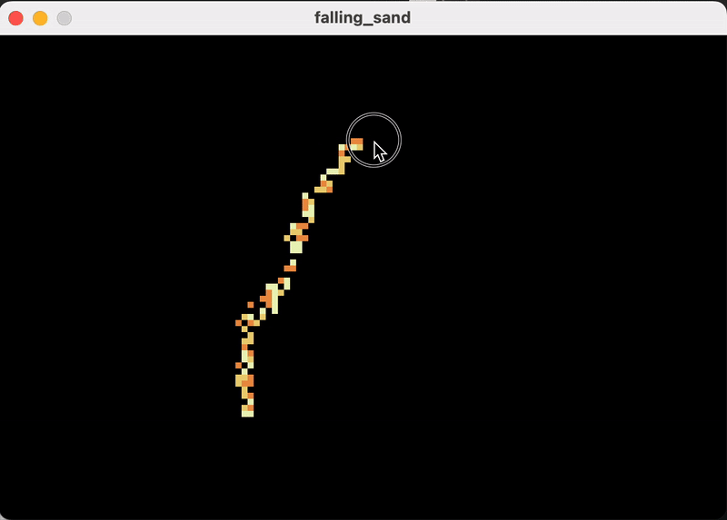

# Falling Sand Simulation

A simple particle-based simulation built in [Processing](https://processing.org/). Sand particles interact with gravity and each other to create realistic falling behavior.

  

## How to Run
1. Install [Processing](https://processing.org/download/).
2. Copy the code into a new Processing sketch.
3. Run the sketch and interact with the simulation!

## Controls
- **Click/Drag**: Add sand particles at the mouse position.

Enjoy experimenting with the simulation!
